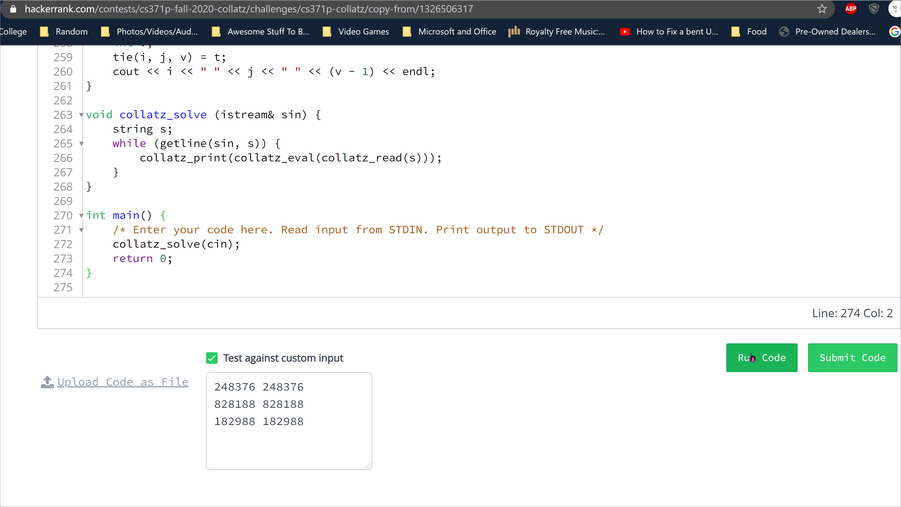
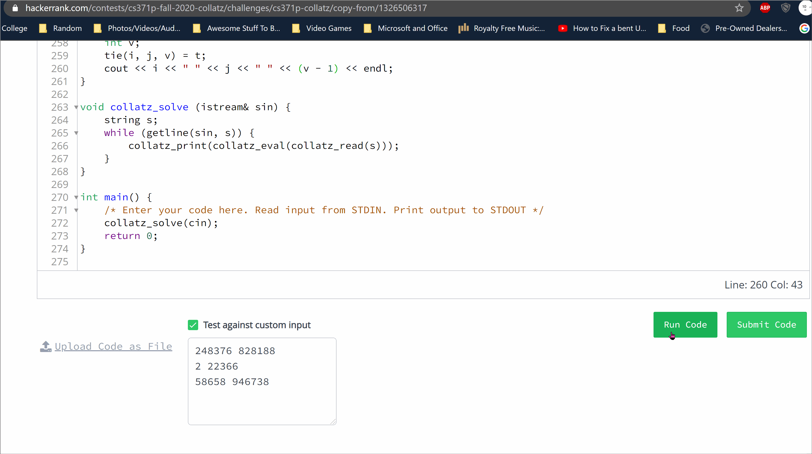

# Collatz

In this project play around with the Collatz's conjecture and find ways to optimize the problem through the use of caches and using patterns in the conjecture to save time when executing the program. The project also put emphasis to test individual components of the code with Google Tests and not assertions.

The goal of the project is to have an input in the format of (n m) where n is the lower bound of a range and m is the upper bound of a range. The output should be in the format of (n m c) where c is the number of collatz cycles of a number between n and m, and c is also the largest collatz cycle found among all numbers between n and m.

Main files to look at are Collatz.cpp and TestCollatz.cpp.

## Display of Project

### Collatz Cycle Length of Numbers

First we will show that the program can accurately calculate the cycle length of a number using HackerRank's custom input. In this display we test out finding the cycle length of 248_376, 828_188, and 182_988. I will also include links to sites that I used to check my work.

Number 248_376 => 119  
Number 828_188 => 281  
Number 182_988 => 72  

DCode: https://www.dcode.fr/collatz-conjecture  
MathCelebrity: https://www.mathcelebrity.com/collatz.php  
Grundsatzlich: https://www.grundsatzlich-it.nl/collatz.html  

### Collatz Cycle Range

Here is where the main objective of the project lies. Simply put we want to know the largest collatz cycle length that is possible between a range of numbers. For example, between the numbers 248_376 and 828_188, the number with the highest collatz cycle was 626_331 with a cycle length of 508.

## Key Features
- Implemented lazy cache
- Implemented meta-cache
- Used mathematical optimizations
- Shows use of git and unit testing with Google Tests

## Object-Oriented Programming Class

This class revolved projects, assignments, lectures around using object-oriented design methodology to many software development problems. The class also focused strongly on standard tools in the software development industry in the projects adn adjusted students to getting used to a generic workflow many companies may follow.

# CS371p: Object-Oriented Programming Collatz Repo

* Name: 

* EID: 

* GitLab ID: jNav56

* HackerRank ID: nava_juan1012

* Git SHA: 1f00a284a08ddce1e3a7f8173dad7b5ecd0bdb3a

* GitLab Pipelines: https://gitlab.com/jNav56/cs371p-collatz/-/pipelines

* Estimated completion time: 10

* Actual completion time: 20

* Comments: Overall this project was ok, the most issues I had came from
implementing the lazy cache because I was not saving the cycles from the
path. Other than that, the thing that stressed me out was navigating
through the use of git and understanding the workflow.

